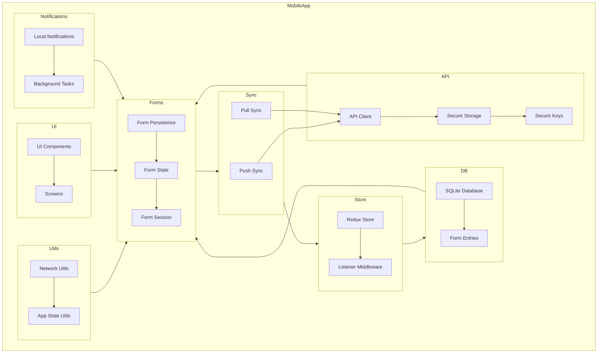

    

    <b>Automatic Architecture Diagrams from Code</b> 
    <a href="https://github.com/swark-io/swark">GitHub</a> • <a href="https://swark.io">Website</a> • <a href="mailto:contact@swark.io">Contact Us</a>

## Usage Instructions

1. **Render the Diagram**: Use the links below to open it in Mermaid Live Editor, or install the [Mermaid Support](https://marketplace.visualstudio.com/items?itemName=bierner.markdown-mermaid) extension.
2. **Recommended Model**: If available for you, use `claude-3.5-sonnet` [language model](vscode://settings/swark.languageModel). It can process more files and generates better diagrams.
3. **Iterate for Best Results**: Language models are non-deterministic. Generate the diagram multiple times and choose the best result.

## Generated Content
**Model**: GPT-4o - [Change Model](vscode://settings/swark.languageModel)  
**Mermaid Live Editor**: [View](https://mermaid.live/view#pako:eNp9VMlu4zAM_RVB5_YHchigqTtAMWmRmbQn2QfFYhIhtmRoQVsU_ffRYslb3YtFPj4uIil_4loywBtcirOi3QW9FKVASNtjVJ_kkTdw13UeHeF3-8eIIHSA2io4GKnoGUjUUK9WiXTfcBCGOLderKbuf-BDJ18vV99GR7e3v0YO0-AjY0-PdhCsFLPyf0vVZnevHAw1QLyEglhNjKA1l6I3R2VC2IPSXBsQdR9jBFSLNKHQUdyVSAPNO63f5fAh6hRib_WF-E9AqwFuGuI_c9gRfZbYwDF7AX-b2bUZktc_YPY9ICSI0Zpz7cKtQJEkoCfOWANvdEQaYoT8ibpewavhTZ7jM5g3qa6kP6Mxx3Y7HIfshDjjGSG5-cyJvJ652OYN_bvjLmw8UEENPVI9HfuDMIqDjrvRK9XUP0-7N_9w5_zy7mXbSeFGpMnr40gbQtcKQLiHFc9q6RgfTTSvp3yWhp94TY3b1tzunaxpM7GQAE3ZOeeW1tezklawF6qvmgw6CkC1HjcUOfNfFOt_LamHvTWI8Yb5jXgpQsPyDhuXplps57HCrizARcpl3dkYasU3uAXVUs7cP_ezxOYCLZR4g0rM4ERtY0r85Ui2Y279Ck7dAFq8McrCDabWSF9_0l03zhe8OdFGw9d_Zubg4Q) | [Edit](https://mermaid.live/edit#pako:eNp9VMlu4zAM_RVB5_YHchigqTtAMWmRmbQn2QfFYhIhtmRoQVsU_ffRYslb3YtFPj4uIil_4loywBtcirOi3QW9FKVASNtjVJ_kkTdw13UeHeF3-8eIIHSA2io4GKnoGUjUUK9WiXTfcBCGOLderKbuf-BDJ18vV99GR7e3v0YO0-AjY0-PdhCsFLPyf0vVZnevHAw1QLyEglhNjKA1l6I3R2VC2IPSXBsQdR9jBFSLNKHQUdyVSAPNO63f5fAh6hRib_WF-E9AqwFuGuI_c9gRfZbYwDF7AX-b2bUZktc_YPY9ICSI0Zpz7cKtQJEkoCfOWANvdEQaYoT8ibpewavhTZ7jM5g3qa6kP6Mxx3Y7HIfshDjjGSG5-cyJvJ652OYN_bvjLmw8UEENPVI9HfuDMIqDjrvRK9XUP0-7N_9w5_zy7mXbSeFGpMnr40gbQtcKQLiHFc9q6RgfTTSvp3yWhp94TY3b1tzunaxpM7GQAE3ZOeeW1tezklawF6qvmgw6CkC1HjcUOfNfFOt_LamHvTWI8Yb5jXgpQsPyDhuXplps57HCrizARcpl3dkYasU3uAXVUs7cP_ezxOYCLZR4g0rM4ERtY0r85Ui2Y279Ck7dAFq8McrCDabWSF9_0l03zhe8OdFGw9d_Zubg4Q)

